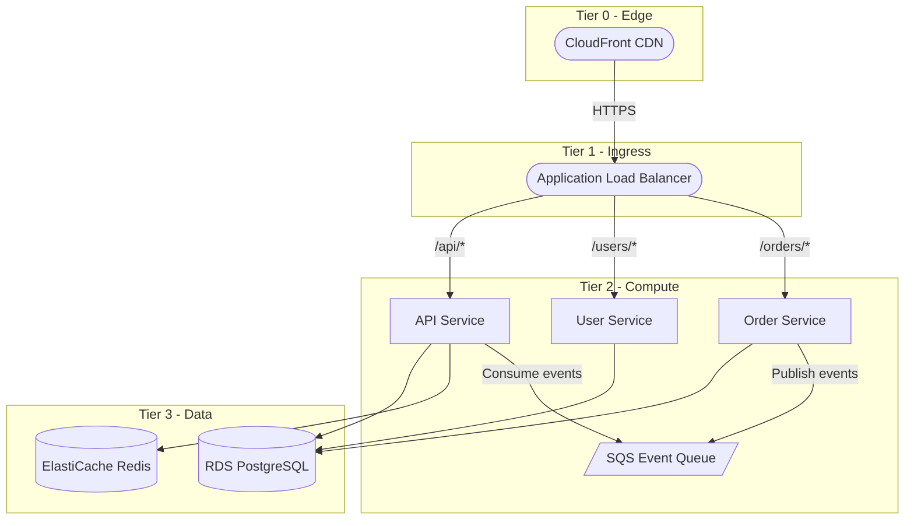
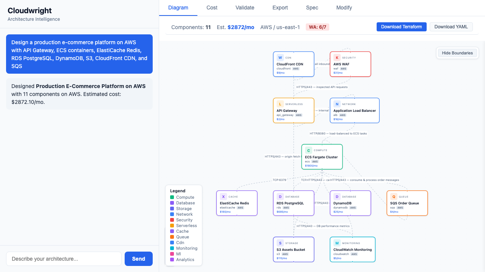
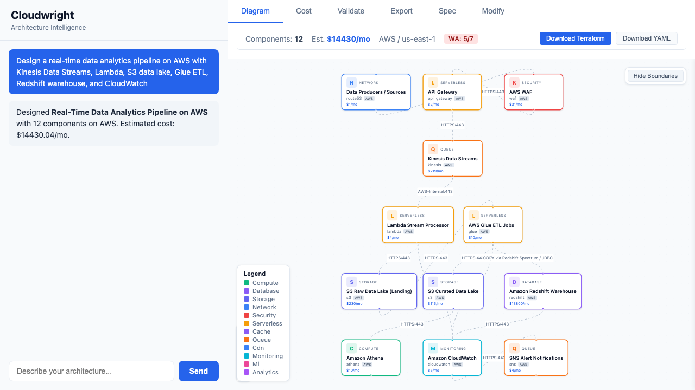
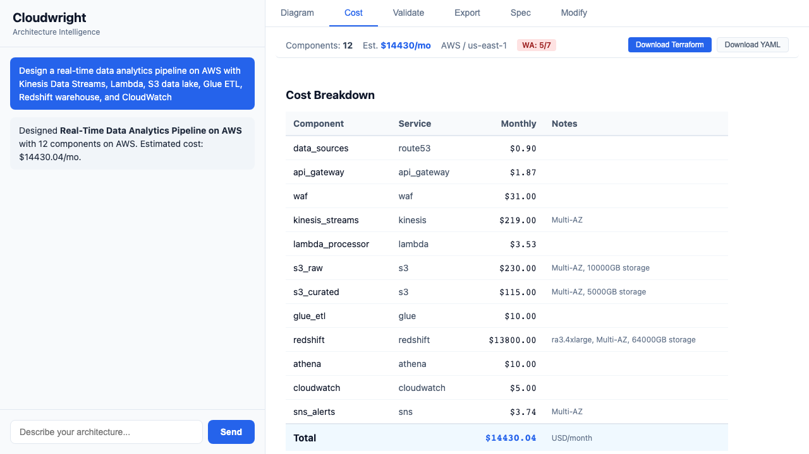
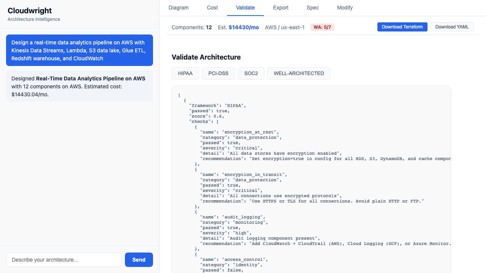

# Cloudwright

Architecture intelligence for cloud engineers.

Cloudwright bridges the gap between a whiteboard sketch and deployable infrastructure. Describe a system in natural language, and Cloudwright produces a structured architecture spec, cost estimates, compliance reports, Terraform/CloudFormation code, diagrams, and diffs — all from a single format called **ArchSpec**.

```
"HIPAA-compliant 3-tier app on AWS, budget $3k/month"
    │
    ▼
┌────────────────────────────────────────────────┐
│  ArchSpec (YAML)                               │
│  ├── 8 components (ALB, ECS, RDS, S3, ...)    │
│  ├── connections with protocols                │
│  └── constraints: hipaa, budget: 3000          │
└────────┬───────────┬──────────┬────────────────┘
         │           │          │
    ┌────▼───┐  ┌───▼────┐ ┌──▼──────────┐
    │  Cost  │  │Validate│ │   Export     │
    │$2,847  │  │ HIPAA  │ │ Terraform   │
    │  /mo   │  │ 5/5    │ │ CFN, Mermaid│
    └────────┘  └────────┘ └─────────────┘
```

## Why Cloudwright

Most cloud tooling assumes you already know what to build (IaC) or already have it deployed (cost dashboards, security scanners). Cloudwright operates in the design phase — the gap where architects currently rely on tribal knowledge, ad-hoc spreadsheets, and copy-pasting last quarter's Terraform.

**One spec, many outputs.** ArchSpec is the universal interchange format. Every module — design, cost, compliance, export, diff, lint, score — reads and writes it. No glue code, no format conversion.

### How it compares

| Capability | Cloudwright | Terraform | Pulumi Neo | Brainboard | Infracost | Checkov |
|---|:---:|:---:|:---:|:---:|:---:|:---:|
| NL to architecture | Y | - | Y | Y | - | - |
| IaC generation | TF + CFN | HCL | Code | TF | - | - |
| Cost estimation | Y (design-time) | - | - | Basic | Y (code-time) | - |
| Compliance validation | 6 frameworks | - | OPA policies | - | - | 2500+ rules |
| Architecture diffing | Y | Plan diff | Preview diff | Drift | Cost diff | - |
| Diagram export | Mermaid + D2 | - | - | Y | - | - |
| SBOM / AIBOM | Y | - | - | - | - | - |
| Multi-cloud | AWS/GCP/Azure | All | All | AWS/GCP/Azure/OCI | AWS/GCP/Azure | All |
| Open source | Y | BSL / OpenTofu | Engine only | - | CLI only | Y |
| Runs locally | Y | Y | Y | - | Y | Y |

Terraform and Infracost are deployment/cost tools that sit *downstream* — Cloudwright generates the Terraform code and estimates costs before any code exists. Checkov and Prowler scan *after* code is written; Cloudwright validates at design time. Brainboard is the closest direct competitor (NL-to-arch + TF), but it's SaaS-only and doesn't do compliance or cost estimation.

Full competitor analysis covering 30 tools across IaC, cost, compliance, and diagramming: [competitor-landscape.md](docs/competitor-landscape.md)

## Quick Start

```bash
pip install 'cloudwright-ai[cli]'
```

Set an LLM provider key:

```bash
export ANTHROPIC_API_KEY=sk-ant-...
# or
export OPENAI_API_KEY=sk-...
```

```bash
# Design from natural language
cloudwright design "3-tier web app on AWS with Redis and PostgreSQL"

# Estimate cost
cloudwright cost spec.yaml

# Validate compliance
cloudwright validate spec.yaml --compliance hipaa,soc2

# Export Terraform
cloudwright export spec.yaml --format terraform -o ./infra

# Compare cost across clouds
cloudwright cost spec.yaml --compare gcp,azure

# Interactive multi-turn design
cloudwright chat
```

## Real-World Examples

### 1. Microservices Platform — Design to Diagram in 30 Seconds

Start from a template, generate a Mermaid architecture diagram, and get a cost breakdown:

```bash
$ cloudwright init --template microservices -o platform.yaml

Created platform.yaml from template 'microservices'
  Provider: aws
  Components: 8

$ cloudwright export platform.yaml --format mermaid
```



```bash
$ cloudwright cost platform.yaml

                       Cost Breakdown — ECS Microservices
┏━━━━━━━━━━━━━┳━━━━━━━━━━━━━┳━━━━━━━━━━━┳━━━━━━━━━━━━━━━━━━━━━━━━━━━━━━━━━━━━━━┓
┃ Component   ┃ Service     ┃   Monthly ┃ Notes                                ┃
┡━━━━━━━━━━━━━╇━━━━━━━━━━━━━╇━━━━━━━━━━━╇━━━━━━━━━━━━━━━━━━━━━━━━━━━━━━━━━━━━━━┩
│ cloudfront  │ cloudfront  │    $42.50 │ 500GB egress                         │
│ alb         │ alb         │    $16.43 │                                      │
│ ecs_api     │ ecs         │   $300.00 │                                      │
│ ecs_user    │ ecs         │   $300.00 │                                      │
│ ecs_order   │ ecs         │   $300.00 │                                      │
│ elasticache │ elasticache │   $360.00 │ cache.t3.medium, redis               │
│ rds         │ rds         │   $388.00 │ db.r5.large, Multi-AZ, 200GB, pg     │
│ sqs         │ sqs         │     $4.00 │                                      │
├─────────────┼─────────────┼───────────┼──────────────────────────────────────┤
│             │             │ $1,710.93 │                                      │
└─────────────┴─────────────┴───────────┴──────────────────────────────────────┘
```

### 2. Blast Radius and SPOF Detection

Find single points of failure and understand which components take everything down:

```bash
$ cloudwright analyze platform.yaml

╭─────────── Blast Radius Analysis: ECS Microservices ────────────╮
│ Components: 8  |  Max Blast Radius: 7  |  SPOFs: 3             │
╰─────────────────────────────────────────────────────────────────╯

Single Points of Failure: cloudfront, alb, ecs_api

Critical Path: cloudfront -> alb -> ecs_api -> rds

                            Component Impact
┏━━━━━━━━━━━━━┳━━━━━━━━━━━━━┳━━━━━━┳━━━━━━━━━━━━━┳━━━━━━━━━━━━━━┳━━━━━━┓
┃ Component   ┃ Service     ┃ Tier ┃ Direct Deps ┃ Blast Radius ┃ SPOF ┃
┡━━━━━━━━━━━━━╇━━━━━━━━━━━━━╇━━━━━━╇━━━━━━━━━━━━━╇━━━━━━━━━━━━━━╇━━━━━━┩
│ cloudfront  │ cloudfront  │    0 │           1 │            7 │ YES  │
│ alb         │ alb         │    1 │           3 │            6 │ YES  │
│ ecs_api     │ ecs         │    2 │           3 │            3 │ YES  │
│ ecs_order   │ ecs         │    2 │           2 │            2 │      │
│ ecs_user    │ ecs         │    2 │           1 │            1 │      │
│ elasticache │ elasticache │    3 │           0 │            0 │      │
│ rds         │ rds         │    3 │           0 │            0 │      │
│ sqs         │ sqs         │    2 │           0 │            0 │      │
└─────────────┴─────────────┴──────┴─────────────┴──────────────┴──────┘

Dependency Graph
└── cloudfront
    └── alb
        ├── ecs_api
        │   ├── rds
        │   ├── elasticache
        │   └── sqs
        ├── ecs_user
        │   └── rds
        └── ecs_order
            ├── rds
            └── sqs
```

### 3. Data Lake — Compliance Audit and Linting

Generate a data lake, then check it against SOC 2 and GDPR before your auditor does:

```bash
$ cloudwright init --template data_lake -o pipeline.yaml
$ cloudwright validate pipeline.yaml --compliance soc2,gdpr

──────────────────────────── SOC 2 Review ─────────────────────────
[FAIL] logging — No logging service found
[FAIL] access_controls — No auth service found
[FAIL] encryption_at_rest — Missing encryption on: s3_raw, s3_processed, redshift
[FAIL] availability — No multi-AZ or load balancer found
[FAIL] change_management — No CI/CD service detected
Score: 0/5 (0%)

──────────────────────────── GDPR Review ──────────────────────────
[FAIL] data_residency — Non-EU regions detected: us-east-1
[FAIL] encryption_at_rest — Unencrypted data stores: s3_raw, s3_processed, redshift
[PASS] encryption_in_transit — All connections use encrypted protocols
[FAIL] access_controls — No authentication service found
[FAIL] audit_trail — No logging or monitoring service found
[FAIL] data_deletion_capability — No TTL, lifecycle, or retention policy found
Score: 1/6 (16%)

$ cloudwright lint pipeline.yaml

                         Lint Results: Data Lake
┏━━━━━━━━━━━┳━━━━━━━━━━━━━━━┳━━━━━━━━━━━━━━┳━━━━━━━━━━━━━━━━━━━━━━━━━━━━━━━━━┓
┃ Severity  ┃ Rule          ┃ Component    ┃ Message                         ┃
┡━━━━━━━━━━━╇━━━━━━━━━━━━━━━╇━━━━━━━━━━━━━━╇━━━━━━━━━━━━━━━━━━━━━━━━━━━━━━━━━┩
│ error     │ no_encryption │ s3_raw       │ No encryption configured        │
│ error     │ no_encryption │ s3_processed │ No encryption configured        │
│ error     │ no_encryption │ redshift     │ No encryption configured        │
│ error     │ single_az     │ redshift     │ Not configured for multi-AZ     │
│ warning   │ no_waf        │ —            │ API gateway present but no WAF  │
│ warning   │ no_monitoring │ —            │ 7 components but no monitoring  │
│ warning   │ no_backup     │ redshift     │ No backup configured            │
│ warning   │ no_auth       │ —            │ No authentication service       │
└───────────┴───────────────┴──────────────┴─────────────────────────────────┘

8 finding(s): 4 error(s), 4 warning(s)
```

### 4. Cross-Cloud Instance Comparison

Compare equivalent instances across AWS, GCP, and Azure — pricing, specs, and storage in one table:

```bash
$ cloudwright catalog compare m5.xlarge n2-standard-4 Standard_D4s_v5

                              Instance Comparison
┏━━━━━━━━━━━━━━━━━━━┳━━━━━━━━━━━━━━━━━━┳━━━━━━━━━━━━━━━━━━━┳━━━━━━━━━━━━━━━━━━━┓
┃ Attribute         ┃        m5.xlarge ┃     n2-standard-4 ┃   Standard_D4s_v5 ┃
┡━━━━━━━━━━━━━━━━━━━╇━━━━━━━━━━━━━━━━━━╇━━━━━━━━━━━━━━━━━━━╇━━━━━━━━━━━━━━━━━━━┩
│ vcpus             │                4 │                 4 │                 4 │
│ memory_gb         │             16.0 │              16.0 │              16.0 │
│ arch              │           x86_64 │            x86_64 │            x86_64 │
│ network_bandwidth │ Up to 10 Gigabit │     Up to 10 Gbps │   Up to 12.5 Gbps │
│ price_per_hour    │          $0.1920 │           $0.1942 │           $0.1920 │
│ price_per_month   │          $140.16 │           $141.77 │           $140.16 │
│ storage_desc      │         EBS only │   Persistent Disk │    Remote Storage │
└───────────────────┴──────────────────┴───────────────────┴───────────────────┘

$ cloudwright catalog search "4 vcpu 16gb"

                         Catalog Search: "4 vcpu 16gb"
┏━━━━━━━━━━━━━┳━━━━━━━━━━┳━━━━━━━━━━━━━━━━━┳━━━━━━━┳━━━━━━━━━━━━━┳━━━━━━━━━┓
┃ Service     ┃ Provider ┃ Label           ┃ vCPUs ┃ Memory (GB) ┃    $/hr ┃
┡━━━━━━━━━━━━━╇━━━━━━━━━━╇━━━━━━━━━━━━━━━━━╇━━━━━━━╇━━━━━━━━━━━━━╇━━━━━━━━━┩
│ e2-standard │ gcp      │ General Purpose │     4 │        16.0 │ $0.1340 │
│ t4g.xlarge  │ aws      │                 │     4 │        16.0 │ $0.1344 │
│ t3a.xlarge  │ aws      │                 │     4 │        16.0 │ $0.1504 │
│ m6g.xlarge  │ aws      │                 │     4 │        16.0 │ $0.1540 │
│ Standard_D4 │ azure    │ General Purpose │     4 │        16.0 │ $0.1720 │
│ m5a.xlarge  │ aws      │                 │     4 │        16.0 │ $0.1720 │
│ ...         │          │                 │       │             │         │
└─────────────┴──────────┴─────────────────┴───────┴─────────────┴─────────┘
```

### 5. Serverless API — From Zero to Terraform

Generate a serverless API spec and export production-ready Terraform in one pipeline:

```bash
$ cloudwright init --template serverless_api -o api.yaml
$ cloudwright cost api.yaml

                    Cost Breakdown — Serverless REST API
┏━━━━━━━━━━━┳━━━━━━━━━━━━━┳━━━━━━━━━┳━━━━━━━━━━━━━━━━━━━━━━━━━━━━━━━━━━━━━━━━━┓
┃ Component ┃ Service     ┃ Monthly ┃ Notes                                   ┃
┡━━━━━━━━━━━╇━━━━━━━━━━━━━╇━━━━━━━━━╇━━━━━━━━━━━━━━━━━━━━━━━━━━━━━━━━━━━━━━━━━┩
│ api_gw    │ api_gateway │   $1.87 │                                         │
│ auth      │ cognito     │   $0.00 │                                         │
│ handler   │ lambda      │  $21.83 │                                         │
│ db        │ dynamodb    │  $25.00 │                                         │
│ storage   │ s3          │  $23.00 │ 1000GB storage                          │
├───────────┼─────────────┼─────────┼─────────────────────────────────────────┤
│           │             │  $71.70 │                                         │
└───────────┴─────────────┴─────────┴─────────────────────────────────────────┘

$ cloudwright export api.yaml --format terraform -o ./infra

Written to ./infra/main.tf
```

The generated Terraform includes provider config, VPC data sources, IAM role variables, and properly tagged resources:

```hcl
resource "aws_api_gateway_rest_api" "api_gw" {
  name = "API Gateway"
  tags = { Name = "API Gateway" }
}

resource "aws_lambda_function" "handler" {
  function_name = "handler"
  role          = var.lambda_role_arn
  handler       = "index.handler"
  runtime       = "python3.12"
  filename      = "lambda.zip"
  tags = { Name = "Lambda Handlers" }
}

resource "aws_dynamodb_table" "db" {
  name         = "db"
  billing_mode = "on_demand"
  hash_key     = "id"
  attribute { name = "id"; type = "S" }
  tags = { Name = "DynamoDB Table" }
}
```

### 6. Architecture Quality Scorecard

Get a letter grade across reliability, security, cost, compliance, and complexity:

```bash
$ cloudwright score platform.yaml --with-cost

╭──────────── Architecture Quality: ECS Microservices ─────────────╮
│ Overall Score: 70/100  Grade: D                                  │
╰──────────────────────────────────────────────────────────────────╯

                              Dimension Breakdown
┏━━━━━━━━━━━━━━━━━┳━━━━━━━┳━━━━━━━━┳━━━━━━━━━━┳━━━━━━━━━━━━━━━━━━━━━━━━━━━━━━┓
┃ Dimension       ┃ Score ┃ Weight ┃ Weighted ┃ Details                      ┃
┡━━━━━━━━━━━━━━━━━╇━━━━━━━╇━━━━━━━━╇━━━━━━━━━━╇━━━━━━━━━━━━━━━━━━━━━━━━━━━━━━┩
│ Reliability     │   100 │    30% │     30.0 │ LB + Multi-AZ enabled        │
│ Security        │    32 │    25% │      8.0 │ 1/10 connections use HTTPS   │
│ Cost Efficiency │    60 │    20% │     12.0 │ $1,710.93/mo (avg $214/comp) │
│ Compliance      │    70 │    15% │     10.5 │ No frameworks specified      │
│ Complexity      │    90 │    10% │      9.0 │ 8 components, 10 connections │
└─────────────────┴───────┴────────┴──────────┴──────────────────────────────┘

Top Recommendations:
  1. Add a WAF for web application protection
  2. Add an authentication service
```

All examples above use real output from `cloudwright-ai 0.2.1` on PyPI — no LLM key required.

## Web UI

Cloudwright includes an interactive web interface for architecture design, visualization, and cost analysis.

```bash
pip install 'cloudwright-ai[web]'
cloudwright chat --web
```

| Architecture Diagram | Cost Breakdown |
|:---:|:---:|
|  |  |
|  |  |

Interactive React Flow diagrams with tier-based layout, service-category color coding, boundary grouping, per-component cost overlay, compliance validation, and one-click Terraform/YAML export.

## Features

### Architecture Design

LLM-powered architecture generation from plain English. Supports multi-turn conversation, constraint-aware design, and natural language modification of existing specs.

```bash
cloudwright design "Serverless data pipeline on GCP with Pub/Sub, Dataflow, and BigQuery" \
  --provider gcp --budget 2000 --compliance gdpr

cloudwright modify spec.yaml "Add a Redis cache between the API and database"

cloudwright chat  # interactive mode with /save, /cost, /export commands
```

100 service keys across three clouds:
- **AWS** (47): EC2, ECS, EKS, Lambda, RDS, Aurora, DynamoDB, S3, SQS, SNS, Kinesis, Redshift, SageMaker, KMS, GuardDuty, CloudTrail, and more
- **GCP** (25): Compute Engine, GKE, Cloud Run, Cloud SQL, Spanner, BigQuery, Pub/Sub, Vertex AI, Cloud Build, and more
- **Azure** (28): Virtual Machines, AKS, Azure Functions, Azure SQL, Cosmos DB, Synapse, Azure ML, Azure Sentinel, and more

The architect applies safe defaults automatically: encryption on data stores, backups on databases, multi-AZ on production workloads, auto-scaling on compute.

### Cost Estimation

Per-component monthly pricing from a built-in SQLite catalog. No external API calls, no rate limits. Supports four pricing tiers.

```bash
cloudwright cost spec.yaml                              # on-demand pricing
cloudwright cost spec.yaml --pricing-tier reserved_1yr  # 1-year reserved
cloudwright cost spec.yaml --compare gcp,azure          # multi-cloud comparison
```

The cost engine resolves prices through three tiers: catalog database (instance-level pricing), registry formula dispatch (10 named formulas for serverless/managed services), and static fallback table (90+ service defaults). Data transfer costs are calculated separately with per-provider egress rates.

Pricing tiers: `on_demand` (1.0x), `reserved_1yr` (0.6x), `reserved_3yr` (0.4x), `spot` (0.3x).

### Compliance Validation

Six compliance frameworks with 35 individual checks:

| Framework | Checks | Key Validations |
|---|---|---|
| HIPAA | 5 | Encryption at rest/transit, audit logging, access control, BAA eligibility |
| PCI-DSS | 5 | WAF, network segmentation, encryption, TLS 1.2+, audit trail |
| SOC 2 | 5 | Logging, access controls, encryption, availability, change management |
| FedRAMP Moderate | 7 | FIPS 140-2, US regions, MFA, audit logging, continuous monitoring |
| GDPR | 6 | EU data residency, encryption, access controls, audit trail, data deletion |
| Well-Architected | 7 | Multi-AZ, auto-scaling, backup, monitoring, SPOF detection, cost optimization |

```bash
cloudwright validate spec.yaml --compliance hipaa,pci-dss,soc2
cloudwright validate spec.yaml --well-architected
cloudwright validate spec.yaml --compliance fedramp --report audit-report.md
```

Exit code 1 on failures, making it CI-friendly.

### Infrastructure Export

Seven export formats from a single ArchSpec:

| Format | Flag | Description |
|---|---|---|
| Terraform HCL | `terraform` | Provider-native resources for AWS (24 types), GCP (11), Azure (10) |
| CloudFormation | `cloudformation` | YAML template with Parameters and Outputs |
| Mermaid | `mermaid` | Tier-grouped flowchart for docs and GitHub |
| D2 | `d2` | D2 diagram language with provider badges |
| CycloneDX SBOM | `sbom` | CycloneDX 1.5 service bill of materials |
| OWASP AIBOM | `aibom` | AI bill of materials documenting LLM usage and risks |
| Compliance Report | `compliance` | Audit-ready markdown with check details and evidence |

```bash
cloudwright export spec.yaml --format terraform -o ./infra
cloudwright export spec.yaml --format mermaid
cloudwright export spec.yaml --format sbom -o sbom.json
```

Terraform output uses variables for sensitive values (no hardcoded passwords or ARNs), includes provider blocks with region configuration, and generates data sources for VPC/subnet discovery.

### Architecture Diffing

Structured comparison between two ArchSpec versions with component-level changes, cost delta, and compliance impact assessment.

```bash
cloudwright diff v1.yaml v2.yaml
```

Detects: added/removed components, changed configurations, connection changes (added/removed/modified), cost impact, and security implications (removal of WAF, encryption changes, auth service changes).

### Multi-Cloud Comparison

Maps equivalent services across providers using 22 cross-cloud equivalence pairs:

```
ec2 <-> compute_engine <-> virtual_machines
rds <-> cloud_sql <-> azure_sql
s3  <-> cloud_storage <-> blob_storage
eks <-> gke <-> aks
...
```

```bash
cloudwright compare spec.yaml --providers gcp,azure
```

Shows side-by-side service mapping with monthly cost totals per provider.

### Architecture Linter

10 anti-pattern checks:

```bash
cloudwright lint spec.yaml
cloudwright lint spec.yaml --strict  # fail on warnings too
```

Errors: unencrypted data stores, single-AZ databases, missing load balancer, public databases, single point of failure.
Warnings: oversized instances (16xlarge+), missing WAF, missing monitoring, missing backups, missing auth.

### Architecture Scorer

Five-dimension quality scoring (0-100, letter grade):

```bash
cloudwright score spec.yaml --with-cost
```

- **Reliability** (30%): load balancing, multi-AZ, auto-scaling, CDN, caching
- **Security** (25%): WAF, auth, encryption, HTTPS, DNS management
- **Cost Efficiency** (20%): budget compliance, per-component ratio, free tier usage
- **Compliance** (15%): framework validation score
- **Complexity** (10%): component count, connection density, tier separation

Grades: A (90+), B (80+), C (70+), D (60+), F (<60).

### Blast Radius Analysis

Dependency graph analysis with SPOF detection and critical path identification.

```bash
cloudwright analyze spec.yaml
cloudwright analyze spec.yaml --component api_gateway  # focus on one component
```

For each component: direct dependents, transitive dependents, blast radius, SPOF status, and tier position.

### Drift Detection

Compares architecture spec against deployed infrastructure.

```bash
cloudwright drift spec.yaml terraform.tfstate
cloudwright drift spec.yaml cloudformation-template.yaml
```

Produces a drift score (0.0-1.0) with lists of drifted, extra, and missing components.

### Policy Engine

Policy-as-code via YAML rules. Nine built-in checks: max_components, all_encrypted, require_multi_az, budget_monthly, no_banned_services, required_tags, min_redundancy, allowed_providers, allowed_regions.

```yaml
# policy.yaml
rules:
  - name: enforce-encryption
    check: all_encrypted
    severity: deny
  - name: budget-cap
    check: budget_monthly
    value: 10000
    severity: deny
  - name: no-azure
    check: allowed_providers
    value: [aws, gcp]
    severity: warn
```

```bash
cloudwright policy spec.yaml --rules policy.yaml
```

Severity levels: `deny` (exit code 1), `warn`, `info`.

### Infrastructure Import

Import existing infrastructure into ArchSpec format:

```bash
cloudwright import terraform.tfstate -o spec.yaml
cloudwright import cloudformation-template.yaml -o spec.yaml
```

Auto-detects format from file extension and content. Plugin support for custom importers via the `cloudwright.importers` entry point.

### Templates

14 starter architectures across three providers:

```bash
cloudwright init --list                              # show available templates
cloudwright init --template serverless_api           # AWS API Gateway + Lambda + DynamoDB
cloudwright init --template gcp_microservices -o .   # GKE + service mesh
cloudwright init --project                           # create .cloudwright/ project directory
```

**AWS** (8): three_tier_web, serverless_api, ml_pipeline, data_lake, event_driven, static_site, microservices, batch_processing.
**GCP** (3): three_tier_web, serverless_api, microservices.
**Azure** (3): three_tier_web, serverless_api, microservices.

### Web UI

FastAPI backend + React frontend for browser-based architecture design.

```bash
pip install 'cloudwright-ai[web]'
cloudwright chat --web
```

10 API endpoints: design, modify, cost, validate, export, diff, catalog search, catalog compare, chat, health.

### Plugin System

Four extension points via Python entry points:

- `cloudwright.exporters` — custom export formats
- `cloudwright.validators` — custom compliance frameworks
- `cloudwright.policies` — custom policy checks
- `cloudwright.importers` — custom infrastructure importers

```bash
cloudwright --list-plugins  # discover installed plugins
```

## ArchSpec Format

ArchSpec is plain YAML, human-editable, and version-controllable alongside code.

```yaml
name: healthcare-portal
version: 1
provider: aws
region: us-east-1

constraints:
  compliance: [hipaa]
  budget_monthly: 5000
  availability: 99.9

components:
  - id: alb
    service: alb
    provider: aws
    label: Application Load Balancer
    tier: 1

  - id: api
    service: ecs
    provider: aws
    label: API Service
    tier: 2
    config:
      launch_type: FARGATE
      cpu: 512
      memory: 1024
      desired_count: 2

  - id: db
    service: rds
    provider: aws
    label: PostgreSQL
    tier: 3
    config:
      engine: postgresql
      instance_class: db.r5.large
      multi_az: true
      encryption: true
      storage_gb: 100

connections:
  - source: alb
    target: api
    protocol: https
    port: 443
  - source: api
    target: db
    protocol: tcp
    port: 5432
```

Components use a 5-tier system for vertical positioning: Edge (0), Ingress (1), Compute (2), Data (3), Storage/Analytics (4).

## CLI Reference

| Command | Description |
|---|---|
| `design <prompt>` | Generate ArchSpec from natural language |
| `modify <spec> <instruction>` | Modify existing spec with natural language |
| `cost <spec>` | Monthly cost breakdown with optional `--compare`, `--pricing-tier` |
| `compare <spec>` | Multi-cloud service mapping and cost comparison |
| `validate <spec>` | Compliance checks with `--compliance`, `--well-architected`, `--report` |
| `export <spec>` | Export to IaC/diagram/SBOM with `--format`, `--output` |
| `diff <spec_a> <spec_b>` | Structured diff with cost delta and compliance impact |
| `import <source>` | Import from Terraform state or CloudFormation |
| `chat` | Interactive multi-turn design session (`--web` for browser UI) |
| `init` | Initialize from template with `--template`, `--project` |
| `lint <spec>` | Anti-pattern detection (`--strict` fails on warnings) |
| `score <spec>` | Quality scoring across 5 dimensions (`--with-cost`) |
| `analyze <spec>` | Blast radius and SPOF detection (`--component` for focus) |
| `drift <spec> <infra>` | Compare design vs deployed infrastructure |
| `policy <spec>` | Evaluate policy rules from YAML (`--rules`) |
| `refresh` | Update catalog pricing data (`--provider`, `--dry-run`) |
| `catalog search <query>` | Search instance catalog by specs |
| `catalog compare <a> <b>` | Side-by-side instance comparison |

Global flags: `--json`, `--verbose / -v`, `--version / -V`.

## Python API

```python
from pathlib import Path
from cloudwright import ArchSpec
from cloudwright.cost import CostEngine
from cloudwright.validator import Validator
from cloudwright.exporter import export_spec
from cloudwright.differ import diff_specs
from cloudwright.linter import lint
from cloudwright.scorer import Scorer

spec = ArchSpec.from_file("spec.yaml")

# Cost
engine = CostEngine()
priced = engine.price(spec)
for item in priced.cost_estimate.breakdown:
    print(f"{item.component_id}: ${item.monthly:,.2f}/mo")

# Compliance
validator = Validator()
results = validator.validate(spec, compliance=["hipaa", "pci-dss"])

# Export
hcl = export_spec(spec, "terraform", output_dir="./infra")
diagram = export_spec(spec, "mermaid")

# Diff
old = ArchSpec.from_file("v1.yaml")
new = ArchSpec.from_file("v2.yaml")
diff = diff_specs(old, new)

# Lint
findings = lint(spec)

# Score
scorer = Scorer()
report = scorer.score(spec)
print(f"Grade: {report.grade} ({report.overall:.0f}/100)")
```

## Service Catalog

Ships as a SQLite database bundled with the package. No network calls required.

- Compute, database, networking, and storage pricing for AWS, GCP, and Azure
- 4 pricing tiers (on-demand, reserved 1yr/3yr, spot)
- Cross-cloud instance equivalences with confidence scores
- 22 service-level equivalence pairs for multi-cloud mapping
- 10 named pricing formulas for managed/serverless services
- 90+ static fallback prices for less common services

```bash
cloudwright catalog search "8 vcpu 32gb memory"
cloudwright catalog compare m5.xlarge n2-standard-4 Standard_D4s_v5
```

## Benchmarks

Evaluated against raw Claude (Sonnet 4.6) across 54 use cases spanning greenfield, compliance, cost optimization, import, microservices, data pipelines, industry-specific, migration, edge computing, and cross-cloud comparison scenarios.

| Metric | Cloudwright | Claude (raw) | Delta |
|---|---|---|---|
| Structural Validity | 79.6% | 37.0% | +42.6 |
| Compliance Completeness | 62.9% | 38.5% | +24.3 |
| Export Quality (IaC) | 55.7% | 0.3% | +55.5 |
| Diff Capability | 100.0% | 0.0% | +100.0 |
| Reproducibility | 77.9% | 35.0% | +42.9 |
| Time to IaC | 82.5% | 0.0% | +82.5 |
| **Overall** | **68.1%** | **28.0%** | **+40.1** |

Cloudwright wins 6 of 8 metrics. Weakest areas (active development): cost accuracy and service correctness on import/migration use cases.

Full results: [benchmark/results/benchmark_report.md](benchmark/results/benchmark_report.md)

## Repository Structure

```
cloudwright/
  packages/
    core/       pip install cloudwright-ai        Models, architect, catalog, cost, validators, exporters
    cli/        pip install 'cloudwright-ai[cli]'     Typer CLI with Rich formatting
    web/        pip install 'cloudwright-ai[web]'     FastAPI + React web UI
  catalog/                                      Service catalog JSON (compute, database, storage, networking)
  benchmark/                                    54 use cases + evaluation framework
```

## Development

```bash
git clone https://github.com/theAtticAI/cloudwright
pip install -e packages/core
pip install -e packages/cli
pip install -e packages/web
```

```bash
pytest packages/core/tests/           # 831 tests
ruff check packages/ && ruff format packages/
```

LLM-dependent tests (architect, chat) require an API key and are skipped by default:

```bash
ANTHROPIC_API_KEY=sk-ant-... pytest packages/core/tests/test_architect.py -v
```

## License

MIT
