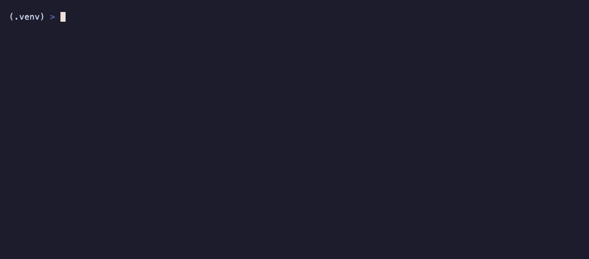
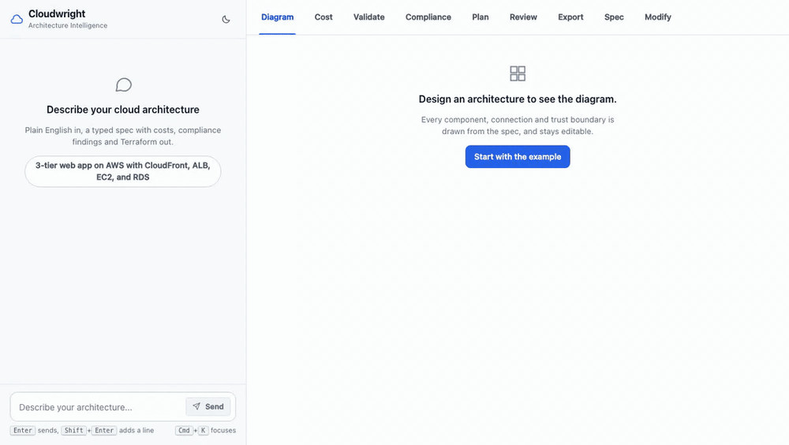
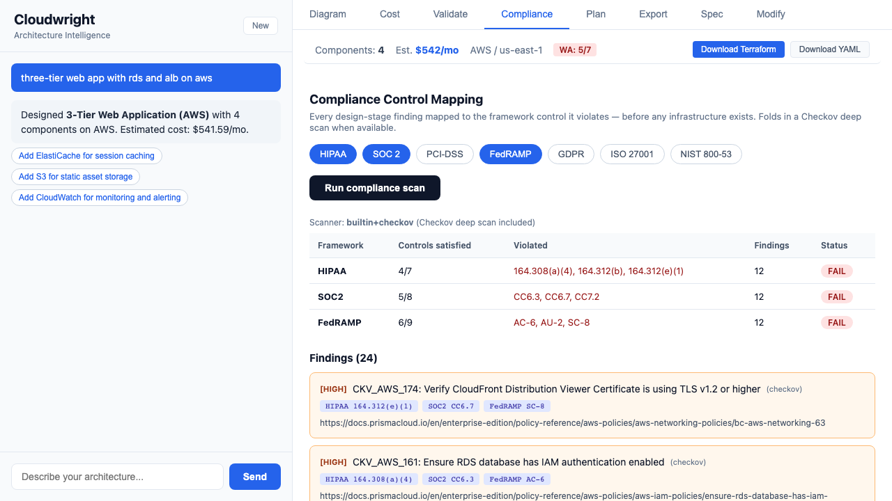
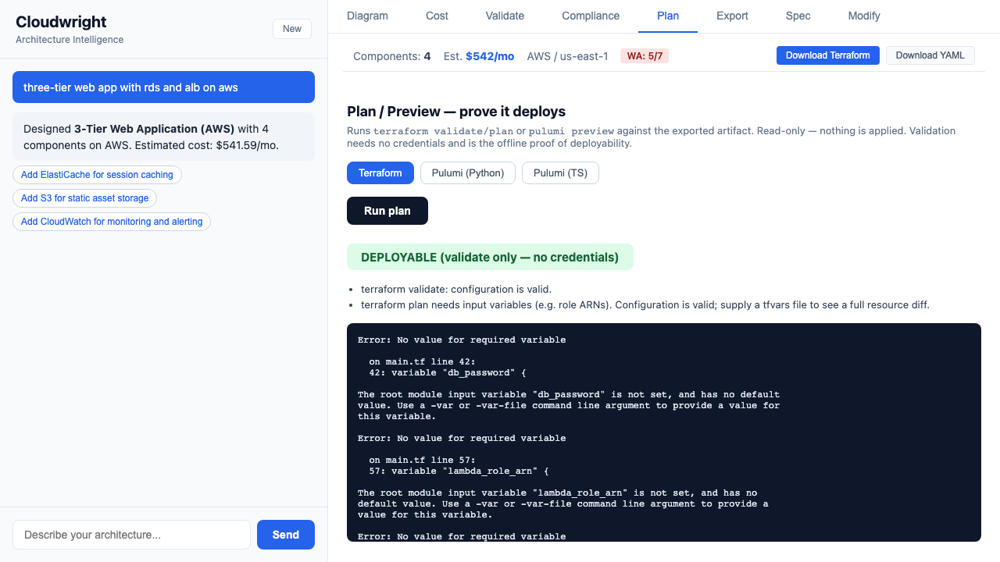
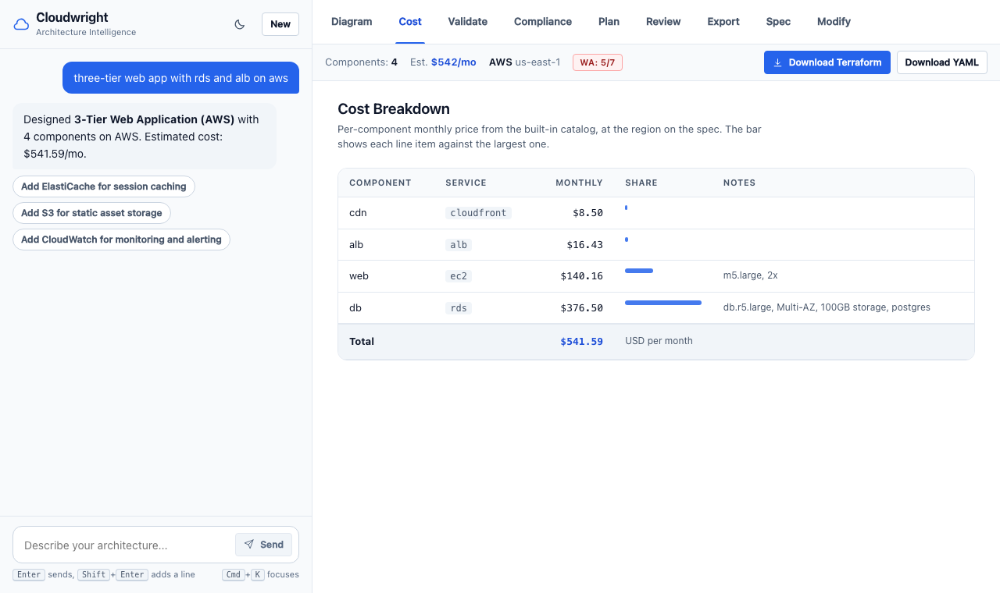
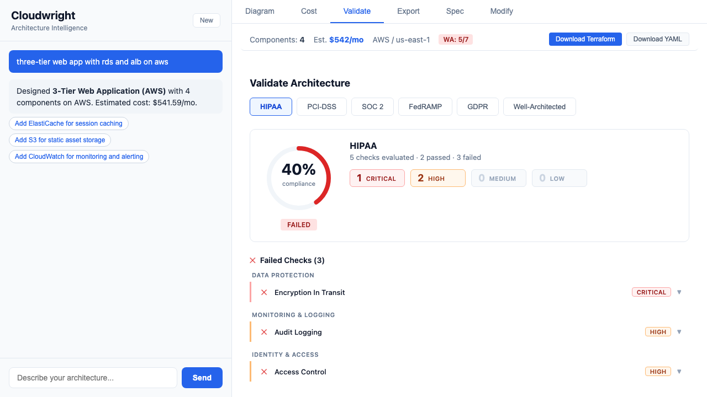
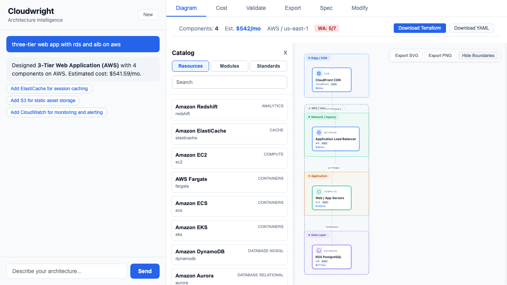

# Cloudwright

*Describe a cloud architecture in English. Get Terraform, costs, and a compliance check.*

[](https://pypi.org/project/cloudwright-ai/)
[](https://github.com/xmpuspus/cloudwright/actions/workflows/ci.yml)
[](LICENSE)
[](https://pypi.org/project/cloudwright-ai/)
[](https://glama.ai/mcp/servers/xmpuspus/cloudwright)

<p align="center">
  
</p>

<p align="center"><em>Prompt to spec, cost breakdown, compliance check, and Terraform in one pass.</em></p>

```bash
pip install 'cloudwright-ai[cli]'
export ANTHROPIC_API_KEY=sk-ant-...
cloudwright design "HIPAA healthcare API on AWS with Postgres and Redis"
```

Cloudwright takes a one-line description of a cloud system and produces a structured architecture spec, a per-component cost breakdown, a compliance report, and ready-to-apply Terraform, Pulumi (TypeScript or Python), or CloudFormation. It works across AWS, GCP, Azure, and Databricks. The latest work adds compliance scanning that maps every finding to the framework control it violates (HIPAA / SOC 2 / FedRAMP / PCI-DSS / ISO 27001 / NIST), a `cloudwright plan` step that proves the exported infrastructure actually deploys, and live import for GCP and Azure alongside AWS.

[Try it](#quickstart) - [What's new](#whats-new) - [Docs](docs/) - [MCP server](#mcp-server-claude--cursor--cline)

## What you get

- Architecture spec (typed YAML, version-controlled, the single source of truth)
- Cost breakdown across AWS, GCP, Azure, Databricks (multi-region, per-component, four pricing tiers)
- Compliance report covering HIPAA, SOC 2, PCI-DSS, FedRAMP Moderate, GDPR, and Well-Architected
- Terraform and CloudFormation export with safe defaults (encryption, IMDSv2, locked-down S3, sensible RDS settings)
- Diagrams in ASCII, Mermaid, D2, and a fully editable web canvas
- MCP server for AI agents (Claude Desktop, Cursor, Cline, and any MCP-compatible client)

## Quickstart

```bash
cloudwright design "HIPAA healthcare API on AWS with Postgres and Redis"
cloudwright cost spec.yaml --workload-profile medium
cloudwright validate spec.yaml --compliance hipaa,soc2
cloudwright export spec.yaml --format terraform -o ./infra
cloudwright chat --web                                # browser canvas at http://localhost:8765
```

All commands except `design`, `modify`, `chat`, and `adr` work fully offline. Set `ANTHROPIC_API_KEY` (preferred) or `OPENAI_API_KEY` to enable the LLM-powered ones. Drop `--json` on any command for machine-readable output.

## Smart Canvas + Module Catalog (v1.2)

<p align="center">
  
</p>

<p align="center"><em>Drag-and-drop canvas with per-provider resource catalog, approved modules, and standards checks.</em></p>

The web diagram is a fully editable architecture canvas. Edits (add, drag, connect, edit fields, delete) are deterministic frontend mutations, so they are instant, free, and reproducible. They do not call the LLM.

A left-side **Catalog drawer** has three tabs:

- **Resources** - the full catalog for the active provider, served by `/api/catalog/services` (case-insensitive `?provider=`).
- **Modules** - approved multi-resource patterns from `/api/modules`. Bundled: AWS Three-Tier Web, AWS Serverless API, AWS Data Lake, GCP Serverless API, Azure Three-Tier Web.
- **Standards** - runs `POST /api/canvas/validate` and surfaces orphan connections, partial modules, unapproved modules, naming-prefix violations, and missing required tags.

When a module instance is intact, the Terraform exporter emits a single `module "<id>"` block with the catalog's pinned `source` and `version`. Modified modules fall back to per-component resource rendering. Mixed specs work: catalog modules render as modules, ad-hoc resources as resources, side by side.

```bash
cloudwright chat --web
# Open http://localhost:8765, use the Catalog drawer, then Export -> Terraform
```

## MCP server (Claude / Cursor / Cline)

Expose Cloudwright as [Model Context Protocol](https://modelcontextprotocol.io/) tools so AI agents can design, cost, validate, and export architectures directly. 18 tools across 6 groups (design, cost, validate, analyze, export, session).

```bash
pip install cloudwright-ai-mcp
cloudwright mcp                              # all tools, stdio
cloudwright mcp --tools design,cost          # subset
cloudwright mcp --transport sse              # SSE for HTTP clients
```

`claude_desktop_config.json` (same shape works for Cursor and Cline):

```json
{
  "mcpServers": {
    "cloudwright": {
      "command": "cloudwright",
      "args": ["mcp"]
    }
  }
}
```

## Analysis

`cloudwright lint` (10 anti-pattern checks), `cloudwright score` (5-dimension quality grade), `cloudwright analyze` (blast radius and SPOF), `cloudwright drift <spec> <tfstate>` (design vs deployed), `cloudwright policy --rules policy.yaml` (policy-as-code with 9 built-in checks), `cloudwright security` (security anti-patterns; also scans exported Terraform HCL), `cloudwright compliance <spec> --frameworks hipaa,soc2,fedramp` (every finding mapped to its HIPAA / SOC 2 / FedRAMP / PCI-DSS / ISO 27001 / NIST control ID, with optional Checkov deep scan), and `cloudwright plan <spec> --target terraform` (proves the exported artifact validates / plans). Every command supports `--json`. See [docs/](docs/) and the `examples/` directory for end-to-end samples.

## Python API

```python
from cloudwright import ArchSpec
from cloudwright.cost import CostEngine
from cloudwright.validator import Validator
from cloudwright.exporter import export_spec

spec = ArchSpec.from_file("spec.yaml")
priced = CostEngine().estimate(spec, workload_profile="medium")
results = Validator().validate(spec, compliance=["hipaa", "pci-dss"])
hcl = export_spec(spec, "terraform", output_dir="./infra")
```

<a id="whats-new"></a>

## What's new

Terminal — `cloudwright compliance` maps every finding to its framework control ID, then `cloudwright plan` proves the Terraform validates:

<p align="center">
  
</p>

Web canvas — the same checks as Compliance and Plan tabs:

<p align="center">
  
</p>

<table>
  <tr>
    <td width="50%"></td>
    <td width="50%"></td>
  </tr>
</table>

- **Compliance scanner with framework control-ID mapping.** `cloudwright compliance spec.yaml --frameworks hipaa,soc2,fedramp` maps every design-stage finding to the exact control it violates — HIPAA `164.312(a)(2)(iv)`, SOC 2 `CC6.1`, FedRAMP `SC-28`, plus PCI-DSS, GDPR, ISO 27001, NIST 800-53 — before any infrastructure exists. No competitor maps findings to control IDs at design time. The mapping runs on the built-in scanner with zero external tooling; when the Checkov binary is present it is run against the exported Terraform and its `CKV_*` findings fold into the same control-mapped report. Per-framework posture table, audit-ready markdown report (`-o report.md`), `POST /api/compliance`, and a Compliance tab in the canvas. `pip install 'cloudwright-ai[compliance]'` for the Checkov deep scan; the control mapping works without it.
- **`cloudwright plan` — prove it deploys.** `cloudwright plan spec.yaml --target terraform` runs `terraform validate` (and `terraform plan` when credentials are present) against the generated artifact; `--target pulumi-python|pulumi-ts` runs `pulumi preview`. Read-only — nothing is applied. `validate` needs no credentials and is the offline proof of deployability; `plan` adds a real `+add ~change -destroy` diff when credentials resolve. DEPLOYABLE / NOT DEPLOYABLE verdict in the CLI, `POST /api/plan`, and a Plan tab in the canvas.
- **Live GCP and Azure import.** `cloudwright import-live --provider gcp --project PROJECT` (Compute Engine, Cloud Storage, Cloud SQL) and `--provider azure --subscription SUB_ID` (Virtual Machines, Storage Accounts, Azure SQL, AKS) join the existing AWS importer — same lazy-SDK, fast-fail-on-credentials, non-fatal-per-service-permission-guard pattern, with security posture captured per resource. `pip install 'cloudwright-ai[live-import]'`.

The demos above are reproducible: `vhs scripts/controls_demo.tape` (terminal) and `python scripts/record_controls_demo.py` against a local web server (template-matched prompt, no API key required).

## What's new in v1.4.0

<table>
  <tr>
    <td width="50%"></td>
    <td width="50%"></td>
  </tr>
  <tr>
    <td width="50%"></td>
    <td width="50%"></td>
  </tr>
</table>

- **Pulumi exporter (TypeScript + Python).** `cloudwright export spec.yaml --format pulumi-ts -o ./infra` writes a complete Pulumi TypeScript project (`index.ts`, `Pulumi.yaml`, `package.json`, `tsconfig.json`). `--format pulumi-python` writes the Python equivalent. AWS, GCP, and Azure coverage matches the Terraform exporter, with the same safe-by-default posture (S3 public-access block + AES256 + versioning, RDS encryption + 7-day backups + deletion protection, EC2 IMDSv2, DynamoDB SSE + PITR, CloudFront TLSv1.2_2021, CloudTrail log-file validation). Aliases `pulumi-typescript` and `pulumi-py` also work.
- **Live AWS import.** `cloudwright import-live --provider aws --region us-east-1 [--profile NAME] [--services ec2,rds,s3] [-o spec.yaml]` walks `boto3 describe-*` calls (EC2, VPC + subnets + security groups, RDS, S3, Lambda, ECS, EKS, DynamoDB, ALB / NLB, CloudFront, SQS, API Gateway, CloudTrail) and produces an ArchSpec from running infrastructure. Captures security posture (S3 encryption + versioning + public-access-block, RDS multi-AZ + backup retention, EC2 IMDSv2, SG ingress 0.0.0.0/0). Best-effort connection inference: ALB to EC2 via target groups, CloudFront to S3 via origin domains. Per-service permission denials are non-fatal. Optional dep: `pip install 'cloudwright-ai[live-import]'`.
- **Two-stage prompting plus boundary-aware spec.** `Architect.design()` now runs Stage 1 (free-text architectural reasoning via Sonnet) followed by Stage 2 (strict JSON projection via Haiku). Stage 2 is told the canonical service keys, allowed connection kinds (`sync_request | async_event | stream | replication | batch`), and boundary kinds (VPC / subnet / security_group / availability_zone / region / account), so it projects faithfully without redesigning. VPCs, subnets, and SGs are now first-class in the LLM contract. Per-stage usage (`stage1`, `stage2`, `total_cost_usd`, `two_stage: true`) is exposed on `/api/design`, `/api/modify`, and their streaming variants. Single-shot path retained as fallback (`Architect(two_stage=False)`).
- **Workload-aware safe defaults.** Pre-v1.4, `_post_validate` forced `encryption=true`, `multi_az=true`, `backup=true`, `auto_scaling=true`, and `count=2` onto every spec, masking Stage 1 reasoning. v1.4 makes these conditional on `spec.metadata.workload_profile`: `sandbox`, `dev`, `test`, `demo`, `poc` keep the LLM's chosen values; `production`, `medium`, `large`, `enterprise` get safe defaults forced. Compliance frameworks (HIPAA, PCI-DSS, SOC 2, GDPR, FedRAMP, HITRUST, ISO 27001) always force encryption + HA regardless of profile.
- **GitHub Action for PR previews.** Drop-in workflow posts an idempotent comment with architecture diff (added / removed / changed components), monthly cost delta (head vs. base, with annual rollup), and per-framework compliance changes whenever a PR touches `*.tf`, `*.tfstate`, `cloudwright.yaml`, or `spec.yaml`. Reusable composite action at `.github/actions/cloudwright-pr-comment/`. See [`docs/github-action.md`](docs/github-action.md).
- **Refreshed Smart Canvas demo GIF** (`examples/cloudwright-smart-canvas-demo.gif`) showing prompt to diagram to catalog drawer to add resource to side-panel edit to cost recomputation against the current UI. Reproducible via `python scripts/record_smart_canvas.py`.
- **Cancel-safe streaming via `AsyncAnthropic` and `AsyncOpenAI`.** `chat/stream` and `design/stream` now use native async clients instead of a `threading.Thread` + `asyncio.Queue` bridge. When a client disconnects mid-stream, `CancelledError` propagates into the SDK's `async with` block and closes the upstream HTTPX connection, so the LLM call stops billing tokens at disconnect rather than at completion. Eliminates orphan threads and queue-full data loss. Sync `send_stream` / `generate_stream` paths are preserved for the CLI; only the web routers switched.

## What's new in v1.3.0

- **Safe-by-default Terraform.** S3 public-access blocks, RDS `storage_encrypted` and `deletion_protection`, EC2 IMDSv2, security-group ingress restricted to listed CIDRs.
- **HCL injection-safe escaping.** All Terraform exporters (AWS, GCP, Azure, Databricks) escape user-supplied config values before interpolation.
- **Per-model LLM pricing.** Haiku (fast classifier) and Sonnet (designer) billed at their respective rates instead of a single hardcoded rate.
- **Anthropic prompt caching.** Roughly 70-80% input-token savings on chat follow-ups, with measurable latency improvement.
- **Atomic SessionStore writes.** No more session corruption on SIGKILL or disk full mid-write.
- **Constant-time API key comparison.** Web API auth is now timing-attack hardened.
- **FedRAMP region allowlist.** `us-east-1` is no longer flagged as FedRAMP-authorized; the validator now matches the actual GovCloud / FedRAMP-authorized region set.
- **Health and version endpoints.** `/health` returns version, configured model, and catalog status. New `/api/version`.
- **Request correlation IDs.** Every web request gets an `X-Request-Id`, plumbed through router logs.
- **`--debug` flag works.** Used to be a silent no-op; now prints prompts, timing, and token counts.
- **`cloudwright chat --web` pinned to port 8765** to match docs and MCP/Slack integrations.
- **Cost in design responses.** `/api/design` and `/api/modify` now return cost in the response payload.
- **Swagger UI gated.** `/docs` is off in production by default; set `CLOUDWRIGHT_DOCS_ENABLED=true` to expose it.

## Compatibility

- Python 3.12+
- LLM providers: Anthropic (Claude Sonnet, Haiku) and OpenAI (GPT-5+ family). Auto-detected from env.
- Clouds: AWS, GCP, Azure, Databricks. 112 service keys total.
- Install variants: `cloudwright-ai[cli]`, `cloudwright-ai[web]`, `cloudwright-ai-mcp`.

## Contributing, license, changelog

- Contributing guide: [CONTRIBUTING.md](CONTRIBUTING.md)
- License: MIT - see [LICENSE](LICENSE)
- Full release history: [CHANGELOG.md](CHANGELOG.md)
