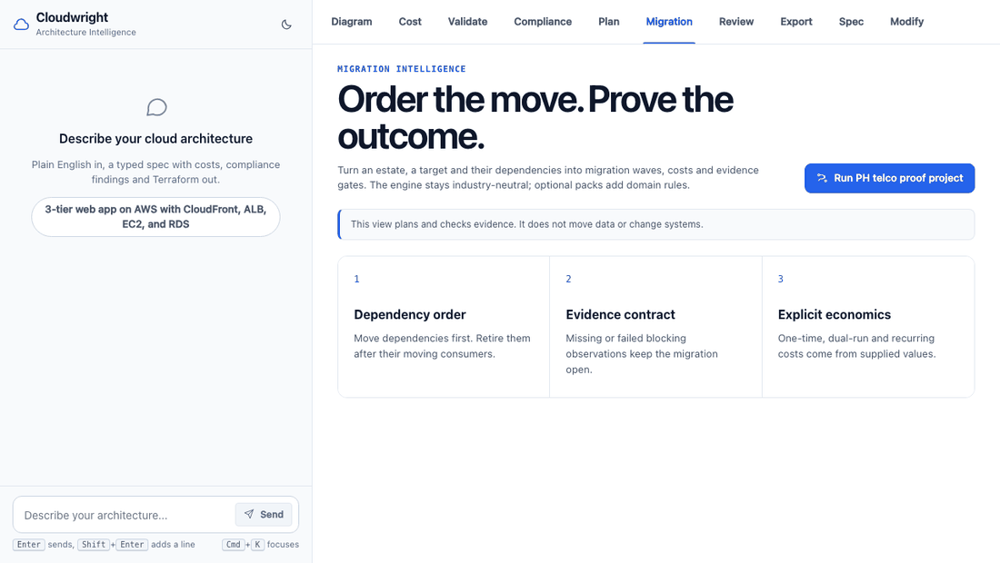
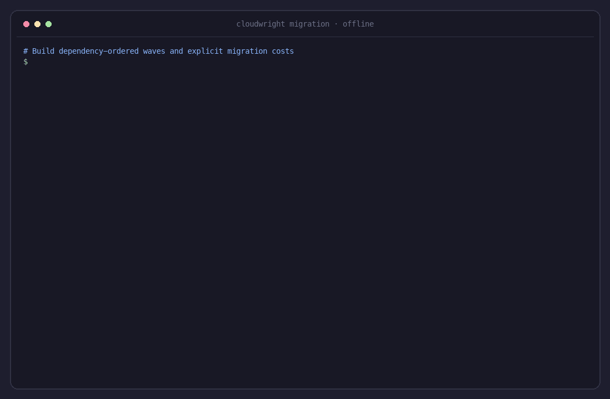

# Cloudwright

*Design a cloud architecture or plan a migration. Get costs, controls, code, and checked evidence.*

[](https://pypi.org/project/cloudwright-ai/) [](https://github.com/xmpuspus/cloudwright/actions/workflows/ci.yml) [](LICENSE) [](https://pypi.org/project/cloudwright-ai/) [](https://glama.ai/mcp/servers/xmpuspus/cloudwright)

<p align="center"></p>

```bash
pip install 'cloudwright-ai[cli]'
export ANTHROPIC_API_KEY=sk-ant-...
cloudwright design "HIPAA healthcare API on AWS with Postgres and Redis"
```

Cloudwright turns one line of English into a typed spec, a cost breakdown, a control-mapped compliance report,
and infrastructure code. A source estate and target become ordered migration waves, explicit costs,
and evidence gates. It covers AWS, GCP, Azure and Databricks across 114 service keys. Only `design`, `modify`,
`chat` and `adr` call a model. Every other command runs offline and needs no API key.

[Quickstart](#quickstart) &middot; [Migrations](#migration-plans-stop-when-evidence-is-missing) &middot; [Compliance](#every-finding-carries-the-control-id-it-violates) &middot; [Agents](#one-mcp-server-reaches-11-coding-agents) &middot; [Docs](docs/) &middot; [Changelog](CHANGELOG.md)

## A prompt produces a spec, a cost, a control-mapped report, and Terraform

- **Spec.** Typed YAML you commit, diff and review. Everything below reads from it.
- **Cost.** Per component and region-aware, with a confidence flag on every line.
- **Compliance.** HIPAA, SOC 2, PCI-DSS, FedRAMP, GDPR, ISO 27001 and NIST 800-53 control IDs.
- **Infrastructure code.** Terraform, OpenTofu, Pulumi (TypeScript or Python) and CloudFormation.
- **Diagrams.** ASCII, Mermaid, D2, and a web canvas you can edit by hand.
- **An MCP server**, so any coding agent runs the same checks inside its own loop.

Exports carry safe defaults. S3 gets a public-access block, SSE and versioning. RDS gets encryption, multi-AZ
and deletion protection. EC2 gets IMDSv2. A compliance framework overrides the workload profile, and always
forces encryption and high availability.

## Quickstart

```bash
cloudwright design "HIPAA healthcare API on AWS with Postgres and Redis"
cloudwright cost spec.yaml --workload-profile medium
cloudwright compliance spec.yaml --frameworks hipaa,soc2
cloudwright export spec.yaml --format terraform -o ./infra
cloudwright plan spec.yaml --target terraform          # proves it deploys, never applies
cloudwright migrate demo                               # packaged migration proof, fully offline
cloudwright chat --web                                 # canvas at http://localhost:8765
```

Add `--json` before any subcommand for machine-readable output, or `--stream` to watch tokens arrive. Set `ANTHROPIC_API_KEY` or `OPENAI_API_KEY` for the four commands that need a model.

## Migration plans stop when evidence is missing

<p align="center"></p>

The migration model covers infrastructure, applications, data, platforms, networks, facilities, and business
services in one dependency graph. It works for on-premises, cloud, cross-cloud, hybrid, data-center, and
application moves. It plans and checks work. It never copies data, applies infrastructure, switches traffic,
or runs a cutover.

```bash
cloudwright migrate plan examples/migrations/ph-telco-project.yaml -o assessment.yaml
cloudwright migrate verify examples/migrations/ph-telco-project.yaml examples/migrations/ph-telco-evidence.yaml
```

<p align="center"></p>

The core has no telco fields. The first proof project selects an external `ph_telco` pack for subscriber,
billing, usage-record, number-porting, privacy, recovery, and source-shutdown gates. A manufacturing ERP
fixture proves the same planner works without that pack. Missing blocking evidence changes the result to
`closed: false` and makes `migrate verify` exit with code 2.

MCP clients use the same engine through `plan_migration` and `verify_migration` in the `migration` tool group.

See [Migration planning and evidence](docs/migrations.md) for the file contract, Python API, HTTP routes,
domain-pack format, limits, and recording commands.

## Every finding carries the control ID it violates

<p align="center"></p>

Other tools scan infrastructure after you deploy it. Cloudwright maps each finding to its control before any
resource exists. The fix then costs a spec edit instead of a change ticket. HIPAA `164.312(a)(2)(iv)`, SOC 2 `CC6.1`
and FedRAMP `SC-28` come from the built-in scanner, with no extra tooling. Checkov folds into the same report
when it sits on your PATH.

- `--oscal` writes an OSCAL 1.1.2 component-definition with deterministic UUIDs.
- `--traceability` prints the chain from component to resource to control to status.
- `cloudwright plan` runs `terraform validate` against the export, and never applies.

## The review needs no API key and no network

<p align="center"></p>

`cloudwright review` runs the scorer, the linter and the validator over a spec, and returns one severity-ranked
report. The same three critics run inside `cloudwright design`. When blocking findings survive generation, the
architect repairs the spec once and records the change in `spec.metadata.critique`. Pass
`Architect(repair=False)` to turn that off.

## Canvas edits never call the model, so they are instant and free

<p align="center"></p>

Add, drag, connect, edit and delete are deterministic frontend mutations. The Catalog drawer serves the resource
list per provider and five approved multi-resource modules. Its standards check flags orphan connections,
partial modules and missing tags. An intact module exports as a single Terraform `module` block, with the
catalog's pinned source and version.

## One MCP server reaches 11 coding agents

```bash
cloudwright integrate --harness claude-code       # exact wiring, in that client's format
cloudwright integrate --harness cursor --write    # merge it into the right file
cloudwright integrate --rules --agent-file claude # a gate block for CLAUDE.md
```

Do not hand-write the config. `cloudwright integrate` emits it for Claude Code, Cursor, Cline, Windsurf, GitHub
Copilot, Zed, Codex CLI, Junie, Kiro and Antigravity. Aider gets a CLI-pipe recipe instead, because it speaks
no MCP. Every client wants a different shape: Zed wants `context_servers`, Copilot wants `servers`, and Codex
wants a TOML table.

The server exposes 24 tools in 10 groups: design, cost, validate, analyze, export, session, review, compliance,
plan and migration. Full matrix in [docs/integrations.md](docs/integrations.md).

## Offline commands grade, scan, compare, and plan

`lint` runs 10 anti-pattern checks. `score` grades 5 dimensions. `analyze` reports blast radius and single
points of failure. `policy` enforces policy-as-code with 9 built-in rules. `security` scans the spec and the
exported HCL. `drift` compares a design against a `tfstate`, and `--remediate` turns the gap into a cost,
compliance and plan preview.

`review`, `compliance` and `plan` are above. See [docs/cli-reference.md](docs/cli-reference.md).

## Python API

```python
from cloudwright import ArchSpec
from cloudwright.cost import CostEngine
from cloudwright.validator import Validator
from cloudwright.exporter import export_spec

spec = ArchSpec.from_file("spec.yaml")
priced = CostEngine().estimate(spec, workload_profile="medium")
findings = Validator().validate(spec, compliance=["hipaa", "pci-dss"])
hcl = export_spec(spec, "terraform", output_dir="./infra")
```

## v1.10.0 adds migration planning with evidence-based closure

- **One model covers the full estate.** Infrastructure, data, applications, platforms, networks,
  facilities, and business services share one dependency graph.
- **Dependencies determine the waves.** The planner schedules prerequisites first, rejects cycles,
  checks rollback paths, and reports unresolved mappings.
- **Closure needs evidence.** Missing or failed blocking observations prevent closure and make
  `migrate verify` return exit code 2.
- **Industry rules stay outside the engine.** Optional YAML packs add acceptance gates without adding
  industry fields to the core.
- **PH telco is the first proof.** The product remains industry-neutral. A manufacturing ERP fixture
  runs through the same planner with no domain pack.

Earlier releases added control-ID mapping and `plan` (v1.5.0), the self-correcting architect and OSCAL
(v1.6.0), `cloudwright integrate` (v1.7.0), the responsive dark-theme canvas (v1.8.0), and measured
canvas interaction fixes (v1.9.0). Full history in [CHANGELOG.md](CHANGELOG.md).

## Compatibility

- Python 3.12+
- Models: Anthropic (Claude Sonnet, Haiku) and OpenAI (GPT-5+ family), auto-detected from env.
- Clouds: AWS, GCP, Azure, Databricks. 114 service keys total.
- Install variants: `cloudwright-ai[cli]`, `cloudwright-ai[web]`, `cloudwright-ai-mcp`.

## Contributing, license, changelog

- Contributing guide: [CONTRIBUTING.md](CONTRIBUTING.md)
- License: MIT, see [LICENSE](LICENSE)
- Full release history: [CHANGELOG.md](CHANGELOG.md)
