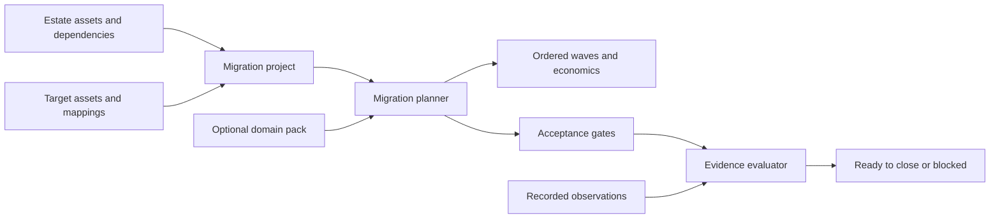

# Migration planning and evidence

Cloudwright can describe a transition across infrastructure, applications, data, platforms,
networks, facilities, and business services. A project may cover cloud-to-cloud, on-premises-to-cloud,
hybrid, data-center, platform, or application work in one model.

The migration engine does not copy data, apply infrastructure, switch traffic, or run a cutover. It
orders declared work, calculates supplied costs, defines acceptance gates, and checks recorded evidence.

## The same contract works across industries

The core model has no telecommunications fields. Industry rules live in optional YAML packs.
Cloudwright ships two proof projects:

- `examples/migrations/ph-telco-project.yaml` selects the `ph_telco` pack.
- `examples/migrations/manufacturing-erp-project.yaml` uses the same planner with no pack.

The PH telco project is the first proof of the extension mechanism. It does not set the product boundary.



## Run the packaged proof project

All four commands run offline and need no model key.

```bash
cloudwright migrate packs
cloudwright migrate plan examples/migrations/ph-telco-project.yaml -o assessment.yaml
cloudwright migrate verify assessment.yaml examples/migrations/ph-telco-evidence.yaml -o evidence-pack.yaml
cloudwright migrate demo
```

Use the global JSON flag before `migrate`:

```bash
cloudwright --json migrate demo
cloudwright --json migrate plan examples/migrations/manufacturing-erp-project.yaml
```

`verify` exits with code 2 when the result is blocked. It still prints or writes the full evidence pack,
including each missing or failed gate.

## Project file

A `MigrationProject` joins the current estate to a proposed target.

```yaml
schema_version: "1.0"
name: ERP transition
industry: manufacturing
estate:
  name: Current estate
  assets:
    - id: erp-db
      name: ERP database
      kind: data
      provider: on_prem
      criticality: critical
      data_classes: [financial_records]
      current_monthly_cost: 8000
    - id: erp-app
      name: ERP application
      kind: application
      provider: on_prem
      current_monthly_cost: 12000
  dependencies:
    - source: erp-app
      target: erp-db
      kind: runtime
      criticality: critical
target:
  name: Private-cloud target
  assets:
    - id: erp-db-target
      name: Managed ERP database
      kind: data
      provider: private_cloud
    - id: erp-app-target
      name: ERP application platform
      kind: application
      provider: private_cloud
  mappings:
    - source_asset_id: erp-db
      target_asset_ids: [erp-db-target]
      disposition: replatform
      rollback: Resume writes on the source database.
      one_time_cost: 30000
      target_monthly_cost: 6000
      dual_run_months: 2
    - source_asset_id: erp-app
      target_asset_ids: [erp-app-target]
      disposition: rehost
      rollback: Restore the source application route.
      one_time_cost: 25000
      target_monthly_cost: 9000
      dual_run_months: 1
metadata:
  currency: USD
```

### Assets

Asset kinds are `infrastructure`, `application`, `data`, `platform`, `network`, `facility`,
`business_service`, and `other`. Each asset can carry:

- Environment, provider, location, owner, criticality, and lifecycle.
- Data classes and tags used by optional packs.
- Current monthly cost.
- Importer-specific attributes.
- Discovery records with source, observation time, reference, and confidence.

### Dependencies

`source` depends on `target`. The planner schedules `target` first. In the example above,
the database moves before the application.

The planner rejects dependency cycles and names the cycle. A `wave_hint` may delay an action, but it
cannot place the action before one of its dependencies.

### Target mappings

Each source asset may have one mapping. Supported dispositions are:

| Disposition | Meaning |
|---|---|
| `retain` | Keep the source asset as it is. |
| `retire` | Remove the source asset after the other moves. A target is optional. |
| `rehost` | Move the asset with minimal design change. |
| `relocate` | Move the existing platform or workload to another location. |
| `replatform` | Change the runtime or managed service without redesigning the whole system. |
| `refactor` | Change application or data design as part of the move. |
| `repurchase` | Move to a purchased product or service. |
| `replace` | Replace the source capability with another target. |

Mappings hold the strategy, owner, downtime allowance, rollback procedure, target assets, and
explicit cost inputs. Any source asset without a mapping appears as unresolved and keeps the plan
incomplete.

## Planner output

`MigrationPlanner.plan()` returns a `MigrationAssessment` with two parts.

### Transition

The transition lists waves in migration order. Each wave lists actions, migrated prerequisites, rollback
procedures, and gate IDs. Assets with a `retain` disposition do not create actions. Retired assets run after the movable
assets.

The economics section reports:

- Current and target monthly run cost.
- Monthly cost change.
- One-time implementation cost.
- Dual-run cost based on each mapping's source cost, target cost, and overlap duration.
- Decommission credit.
- Net migration cost.
- Payback months when monthly savings are positive.

Cloudwright does not invent missing prices. Existing architecture pricing, a CMDB, a contract record,
or another importer can supply the values.

### Assurance

Every migration wave gets a blocking rollback-readiness gate. A selected domain pack can add more
gates by matching asset kinds, data classes, and tags.

Gate categories are operational, data, financial, security, compliance, resilience, and
decommissioning. Comparators are `eq`, `gte`, `lte`, `zero`, and `true`.

## Evidence file

An observation names one gate, one value, its source, and its observation time.

```yaml
project_name: ERP transition
observations:
  - criterion_id: wave-1-rollback-ready
    value: true
    source: change-record
    observed_at: "2026-08-24T01:00:00Z"
```

The evaluator checks that:

- The evidence belongs to the assessment's project.
- Each observation names a known gate once.
- The observation source matches the gate's needed evidence source.
- The recorded value satisfies the comparator and target.
- Every missing gate stays visible in the output.

A missing or failed blocking gate keeps `closed` false. Non-blocking failures stay visible but do
not stop closure. The evaluator never fills in missing evidence.

## Domain packs

Pack files live under `cloudwright/data/migration_packs/` and ship inside the core wheel. A pack has
metadata, source references, and criterion templates.

```yaml
name: manufacturing_quality
title: Manufacturing quality
version: "1.0"
jurisdiction: general
description: Quality gates for production-system moves.
sources: []
criteria:
  - id: production-order-parity
    name: Production orders reconcile
    category: data
    metric: production_order_parity_percent
    comparator: gte
    target_value: 100
    unit: percent
    blocking: true
    required_evidence: reconciliation-job
    control_references: []
    match:
      data_classes: [production_orders]
```

Matchers can name asset kinds, data classes, or tags. Each populated matcher field must match an
asset. A template is added once even when several assets match it. Pack criterion IDs must be unique.

Add the pack's YAML path to the core package artifacts before building a wheel. Test both a matching
asset and an unrelated asset so the pack does not add gates outside its domain.

## PH telecommunications proof pack

The `ph_telco` pack adds 17 gates to the five generic wave gates in the supplied project. The gates
cover subscriber and SIM reconciliation, activation and deactivation, prepaid and billing totals,
usage records, number porting, voice, SMS, data sessions, privacy review, access review, recovery,
failover, and source shutdown.

The pack cites:

- [Data Privacy Act of 2012](https://privacy.gov.ph/data-privacy-act/)
- [SIM Registration Act](https://lawphil.net/statutes/repacts/ra2022/ra_11934_2022.html)
- [Mobile Number Portability Act](https://lawphil.net/statutes/repacts/ra2019/ra_11202_2019.html)
- [NPC Advisory 2024-01 on cross-border transfers](https://privacy.gov.ph/wp-content/uploads/2024/06/Published-NPC-Advisory-No.-2024-01-Contractual-Clauses-for-Cross-Border-Transfers_30May24.pdf)

These references explain why a proof gate exists. Passing the pack is not a legal opinion, regulator
approval, operator certification, or proof that a live migration succeeded.

## Python API

```python
from cloudwright.migration import (
    EvidenceEvaluator,
    EvidenceInput,
    MigrationPlanner,
    MigrationProject,
)

project = MigrationProject.from_file("project.yaml")
assessment = MigrationPlanner().plan(project)

evidence = EvidenceInput.from_file("evidence.yaml")
evidence_pack = EvidenceEvaluator().evaluate(assessment, evidence)

assessment_path = "assessment.yaml"
with open(assessment_path, "w", encoding="utf-8") as output:
    output.write(assessment.to_yaml())

if not evidence_pack.closed:
    raise SystemExit("Migration evidence is blocked")
```

For the installed proof project:

```python
from cloudwright.migration.demo import load_demo, run_demo

project, evidence = load_demo("ph_telco")
result = run_demo("ph_telco")
assert result.evidence_pack.closed
```

## HTTP API and web view

The FastAPI package exposes:

- `GET /api/migration/packs`
- `POST /api/migration/plan`
- `POST /api/migration/verify`
- `GET /api/migration/demo`

This endpoint accepts the portable project, its recorded evidence, and an optional pack
override. It rebuilds the assessment on the server before evaluating evidence, so edited planner
output cannot remove acceptance gates from an HTTP closure decision.

The Migration tab calls the packaged demo endpoint. It shows the closure result, counts, economics,
ordered wave route, and evidence grouped by category. It works before an architecture is generated
in chat.

## Reproduce the GIFs

Start the local server, then record the browser view:

```bash
python3 scripts/_serve_with_mock_llm.py 8765
python3 scripts/record_migration_demo.py --url http://127.0.0.1:8765
```

Record the CLI with the local Pillow fallback:

```bash
python3 scripts/record_migration_cli_demo.py
```

When VHS and ffmpeg both work, the supplied tape records the same CLI flow:

```bash
vhs examples/tapes/cloudwright-migration.tape
```

Both recorders use local fixtures and unset model keys. They make no cloud calls.

## Current limits

- Discovery adapters must supply the estate. This version does not scan networks, packets, or flows.
- Target mappings are explicit. The planner does not choose a migration disposition for the user.
- Users supply cost values. Cloudwright does not quote prices.
- Users record evidence. Cloudwright does not run a production test or certify its source.
- Cloudwright only plans and checks evidence. A separate execution tool must do the move.
